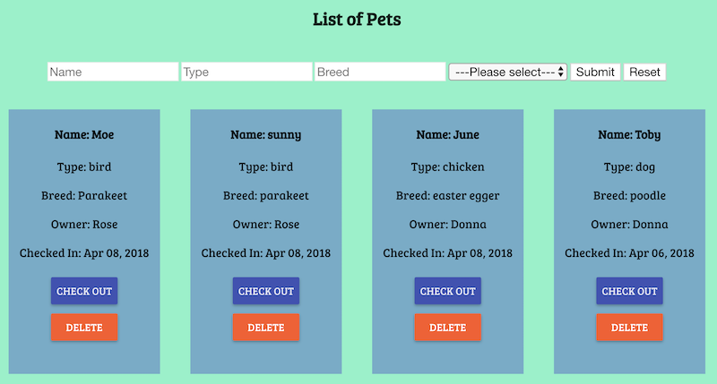
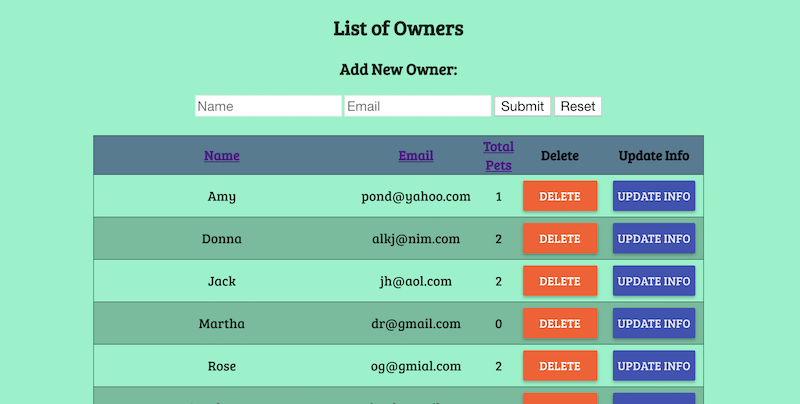

# Angular Pet Hotel

This is an application to track the pets and pet owners at a pet hotel. Pets are tracked according to owner ID number, and the application tracks the number of pets for each owner.

You can to enter in a new pet, and choose the owner from the drop down menu. Each owner is given a unique ID number, so you are able to easily track which pet belongs to which owner. 

 

You are able to enter in a new owner and update a current owner's name or address. In addition, if a pet or owner no longer uses the pet hotel, you are able to delete the pet or owner from the database. You are not able to delete an owner from the database unless the owner has no pets in the database. 

 

## Setup Instructions

* Run `npm install`
* Run `npm start`
* Navigate to `http://localhost:5000/#!/pet`

## Create the Database and Tables with PostgreSQL

Create a new database called `prime_solo_app` and a schema called `workoutApp`. 

``` SQL
CREATE TABLE "pet" (
	"id" SERIAL PRIMARY KEY,
	"name" VARCHAR(25),
	"type" VARCHAR(25),
	"breed" VARCHAR(120),
	"checked_in" BOOLEAN,
	"owner_id" INTEGER FOREIGN KEY REFERENCES "owner"("id")
);

CREATE TABLE "owner" (
	"id" SERIAL PRIMARY KEY,
	"first_name" VARCHAR(25),
	"email" VARCHAR(60)
);
```
Sample data is available in database.sql.

## Next Steps

In the future, I would like to add the following functionality:

* Ability to update pet information
* Ability to add a pet photo